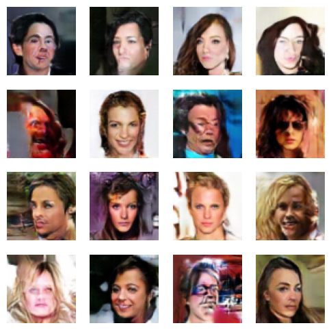

# Face Generator using DCGAN

This project implements a Deep Convolutional Generative Adversarial Network (DCGAN) to generate human faces. The model is built using PyTorch and trained on the CelebA dataset.

## Features

- Custom PyTorch `Dataset` and `DataLoader` for efficient image loading and processing.
- **Generator**: Neural network architecture utilizing linear layers followed by transposed convolutions to generate images from random latent vectors.
- **Discriminator**: Convolutional neural network using LeakyReLU activations to classify images as real (from the dataset) or fake (generated by the Generator).
- **GPU Acceleration**: Supports CUDA to significantly speed up training if a compatible GPU is available.

## Requirements

To run the notebook, you will need the following libraries:

- Python 3.x
- PyTorch
- torchvision
- NumPy
- Matplotlib
- Pillow (PIL)

You can install the necessary dependencies using `pip`:

```bash
pip install torch torchvision numpy matplotlib pillow
```

## Dataset

The model is trained on the [CelebFaces Attributes (CelebA) Dataset](https://www.kaggle.com/datasets/jessicali9530/celeba-dataset). It contains over 200,000 celebrity images. 

To use the notebook, make sure the dataset is placed correctly as expected by the script:
`datasets/jessicali9530/celeba-dataset/img_align_celeba/img_align_celeba`

## Usage

1. Clone this repository or download the `Face-Generator-using-DCGAN.ipynb` notebook.
2. Download and extract the CelebA dataset to the path specified in the notebook.
3. Open the Jupyter Notebook:
   ```bash
   jupyter notebook Face-Generator-using-DCGAN.ipynb
   ```
4. Run the cells to initialize the models, prepare the data, and start the training process. The notebook will also generate and display sample faces as the training progresses.

## Architecture Highlights

- **DCGAN**: Deep Convolutional GANs are a class of CNNs used for unsupervised learning. They help bridge the gap between CNNs for supervised learning and GANs for unsupervised learning.
- **Latent Space**: The Generator creates face images from a random noise vector (latent space).
- **Adversarial Training**: The Generator tries to fool the Discriminator, while the Discriminator tries to distinguish real faces from the fake ones generated by the Generator. This competition improves both networks over time.

## Hyperparameters

- **Latent Dimension**: 100
- **Epochs**: 25
- **Batch Size**: 128
- **Learning Rates**: 
  - Generator: `2e-4`
  - Discriminator: `1e-4`
- **Optimizer**: Adam (`betas=(0.5, 0.999)`)
- **Loss Function**: Binary Cross Entropy with Logits (`BCEWithLogitsLoss`)

## Results

After training the model for 25 epochs, the generator is capable of generating realistic human faces from random noise. Here is an example of the generated output:


